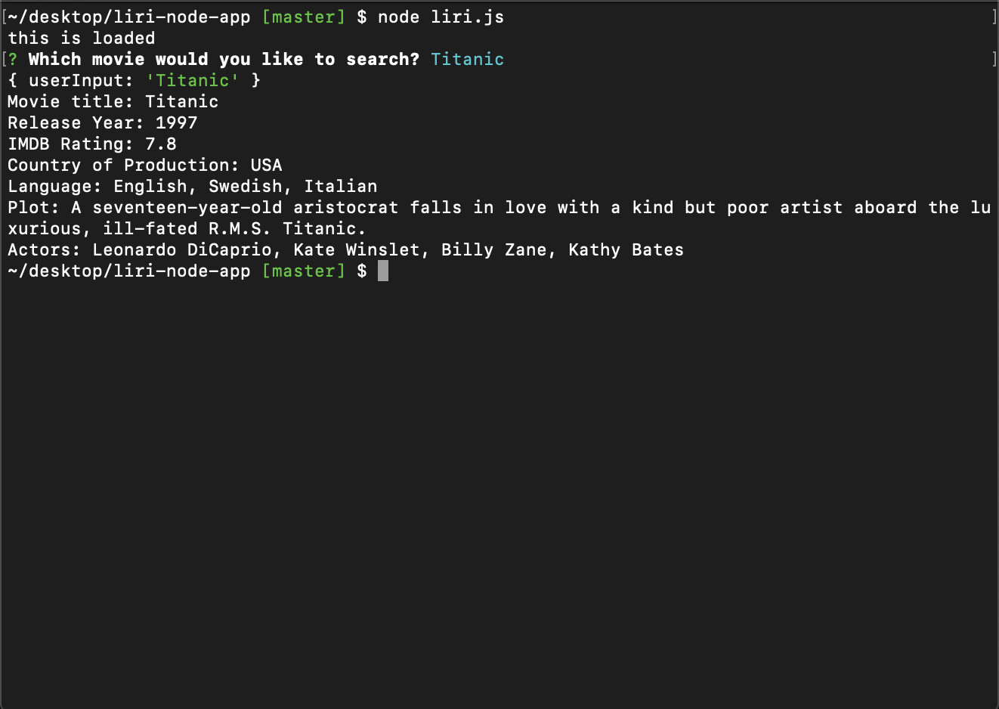
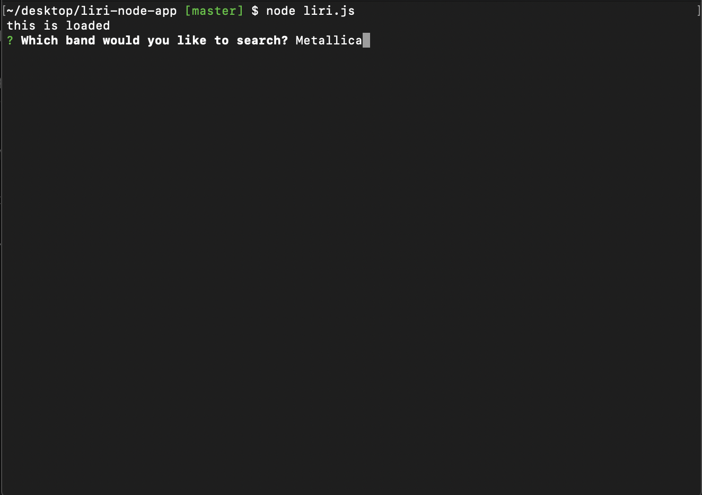
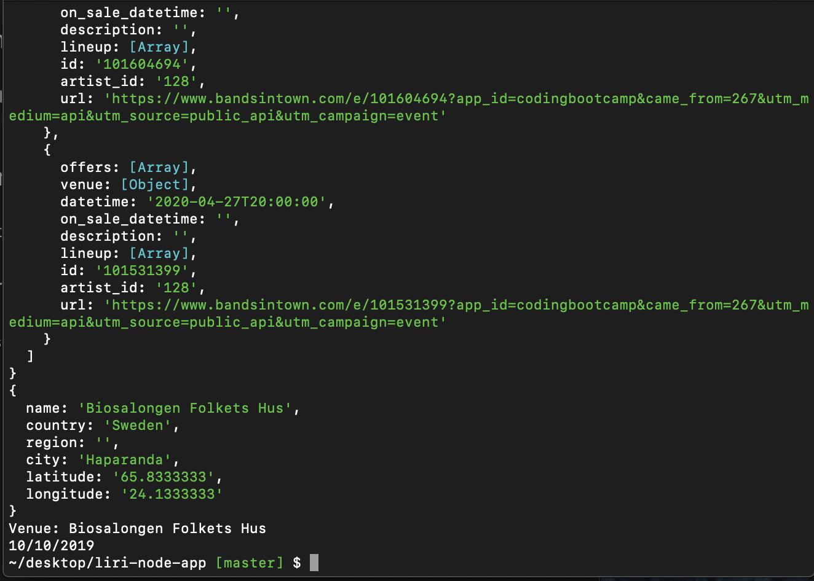
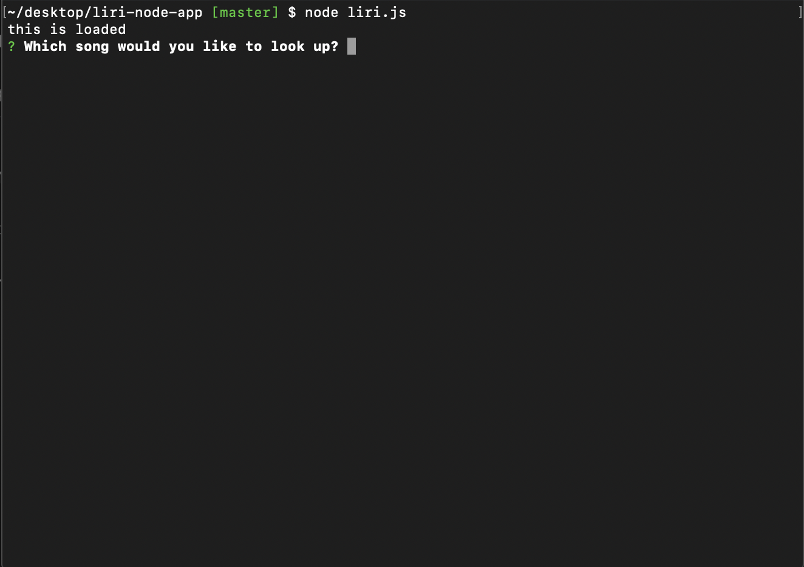

# liri-node-app

## Summary

This application is supposed to gather the users input and give them information on a movie, band, or song.

## Pictures



Here is the first section of this project. After "node liri.js", a question will appear. The user will answer the question and get information about the movie back.



This is part two. The user is asked which band they would like to view.



And it will give the user, the location, venue, and time of a concert by the band.



The last part asks the user for a song.


## Technologies Used

Node.js - node is used to collect the data requested by the user.

## Code Snippet

Here is the section for the movie portion of this project. At the top is the prompt that asks users for a movie title. Next is the url call which gives the user movie information like the release year and plot.

``` js

inquirer.prompt([
    {
        type: "input",
        name: "userInput",
        message: "Which movie would you like to search?"
    }

]).then(function (response) {
    console.log(response);
    var movieURL = "http://www.omdbapi.com/?t=" + response.userInput + "&y=&plot=short&apikey=ebe5df1e";


    axios.get(movieURL).then(
        function (response) {
            console.log("Movie title: " + response.data.Title);
            console.log("Release Year: " + response.data.Year);
            console.log("IMDB Rating: " + response.data.imdbRating);
            console.log("Country of Production: " + response.data.Country);
            console.log("Language: " + response.data.Language);
            console.log("Plot: " + response.data.Plot);
            console.log("Actors: " + response.data.Actors);

        })

})